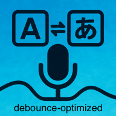

# Bridge(Ver.4.1-nano) - デバウンス最適化版 + TTS機能



スマートフォンやタブレット向けに最適化された、日本語と英語間のリアルタイム音声翻訳を行うプログレッシブウェブアプリケーション（PWA）です。GPT-4.1-nanoモデルを活用した高精度な翻訳機能と、言語特性を考慮したデバウンス最適化機能、そして翻訳結果の音声読み上げ（TTS）機能を提供します。

## 新機能

### TTS（音声読み上げ）機能

翻訳結果を音声で読み上げる機能を搭載：

- **タップで再生**: 翻訳ボックスをタップすると音声で読み上げ
- **再生中タップで停止**: 再生中にタップすると停止
- **言語切り替え**: 日本語→英語の翻訳は英語音声で、英語→日本語の翻訳は日本語音声で読み上げ
- **ON/OFF切り替え**: 設定から音声読み上げの有効/無効を切り替え可能
- **Web Speech API使用**: 追加のAPIキー不要で、ブラウザネイティブの音声機能を使用
- **スマートフォン対応**: iOS Safari、Android Chromeで動作確認済み

### レスポンシブレイアウト

画面の向きに応じて最適なレイアウトを自動切り替え：

- **横画面（ランドスケープ）**: 原文と翻訳を左右に並べて表示し、同時に確認可能
- **縦画面（ポートレート）**: ボタンを小さく横並びに配置し、翻訳エリアを最大化

### 視覚的状態フィードバック

翻訳処理の状態を色で直感的に把握：

- **録音中**: 原文ボックスが青く点滅
- **翻訳中**: 翻訳ボックスがオレンジに点滅
- **翻訳完了**: 翻訳ボックスが緑色に変化（タップで再生可能）

### エラーレポートシステム

問題発生時にワンクリックでGitHub Issueを作成：

- **自動ログ収集**: コンソールログを自動的に収集
- **環境情報**: ブラウザ、OS、画面サイズなどを自動取得
- **GitHub連携**: レポートボタンからIssue作成画面へ直接遷移

### デバウンス最適化

科学的アプローチに基づいて言語別のデバウンス時間を最適化し、大幅な性能向上を実現：

- **日本語**: 500ms → **346ms**（31%の応答速度向上）
- **英語**: 500ms → **154ms**（69%の応答速度向上）

**最適化の科学的根拠**:
- **日本語話者の特徴**: 文節区切りを重視した丁寧な話し方（346ms最適値）
- **英語話者の特徴**: 連続流暢な話し方パターン（154ms最適値）
- **認知科学に基づく設計**: 各言語の自然な話し方リズムに最適化

## 特徴

- **GPT-4.1-nano搭載**: 最新のOpenAI言語モデルによる高精度翻訳
- **TTS（音声読み上げ）機能**: 翻訳結果をタップして音声で再生
- **レスポンシブレイアウト**: 横画面で左右分割、縦画面でコンパクト表示
- **視覚的状態フィードバック**: 録音中/翻訳中/完了を色で表示
- **デバウンス最適化**: 言語特性を考慮した動的デバウンス調整
- **モバイルファーストデザイン**: スマートフォンやタブレットに完全対応
- **リアルタイム音声翻訳**: 日本語から英語、英語から日本語への即時翻訳
- **プログレッシブウェブアプリ（PWA）**: ホーム画面に追加してアプリのように使える
- **ストリーミングレスポンス**: 話しながら翻訳結果がリアルタイムで表示
- **言語選択機能**: 入力言語を明示的に選択して認識精度を向上
- **調整可能なフォントサイズ**: 設定画面から4段階（小/中/大/特大）で調整可能
- **オフライン機能**: PWAとしてインストールすれば通信状況が悪くても素早くアクセス可能
- **タッチ最適化インターフェース**: 大きなボタンとタッチ操作に適したコントロール
- **エラーレポート機能**: 問題発生時にGitHub Issueを簡単に作成

## デモ

[ライブデモを見る](https://aichirofunakoshi.github.io/Bridge-Ver.4.1-nanoTTS/)

## 使用技術

- **Web Speech API**: リアルタイム音声処理のためのブラウザネイティブ音声認識＆音声合成（TTS）
- **OpenAI API**: 高品質な翻訳のためのGPT-4.1-nanoモデルを使用
- **デバウンス最適化**: 言語別の科学的最適化アルゴリズム
- **Fetch Streaming**: リアルタイム翻訳出力のためのストリーミングレスポンス実装
- **プログレッシブウェブアプリ**: iOSとAndroidデバイスへのインストール対応
- **レスポンシブデザイン**: 画面の向き（横/縦）に応じた最適レイアウト

## 性能比較

| 言語 | 従来版 | 最適化版 | 改善率 | 期待効果 |
|------|--------|----------|--------|----------|
| 日本語 | 500ms | **346ms** | **31%改善** | 自然な文節区切りに対応 |
| 英語 | 500ms | **154ms** | **69%改善** | 流暢な連続話法に追従 |

## 利用開始

### 必要な準備

- OpenAI APIキー（[こちらで取得](https://platform.openai.com/api-keys)）
- 最新のモバイルブラウザ（Chrome、Safari、Edge）

### インストール方法

#### モバイルでPWAとしてインストール:

1. Safari（iOS）またはChrome（Android）でアプリを開く
2. iPhone/iPad: 共有ボタン → 「ホーム画面に追加」
3. Android: メニュー → 「ホーム画面に追加」または「アプリをインストール」

#### 開発用:

1. このリポジトリをクローン:
   ```bash
   git clone https://github.com/AichiroFunakoshi/Bridge-Ver.4.1-nanoTTS.git
   cd Bridge-Ver.4.1-nanoTTS
   ```

2. ローカルのHTTPSサーバーを起動（マイク アクセスに必要）:

   Pythonを使用:
   ```bash
   python3 -m http.server 8443 --ssl
   ```

   または、VS CodeのLive Server with SSL

3. モバイルブラウザでローカルサーバーのHTTPS URLを開く

4. 初回使用時にOpenAI APIキーを入力

### デプロイ

このアプリケーションは以下の静的ホスティングサービスにデプロイできます:

- GitHub Pages
- Netlify
- Vercel
- Firebase Hosting
- AWS S3

以下の機能に必要なため、HTTPS対応のホスティングを使用してください:
- マイクへのアクセス
- PWAインストール
- Service Worker機能

## 使用方法

> **注意**: 翻訳機能を使用するには、事前にOpenAI APIキーの設定が必要です（[利用開始](#利用開始)参照）。

1. 「日本語開始」ボタンをタップして日本語録音を開始（346ms最適デバウンス）
2. 「English Start」ボタンをタップして英語録音を開始（154ms最適デバウンス）
3. デバイスのマイクに向かってはっきりと話す
4. 「原文」セクションで音声のリアルタイム文字起こしが確認できます
5. 「翻訳」セクションで翻訳結果が表示されます（緑色に変化したらTTS再生可能）
6. 翻訳ボックスをタップすると音声で読み上げ（再生中にタップで停止）
7. 「停止」ボタンをタップして録音を終了
8. 歯車アイコンから設定を開き、フォントサイズやTTSのON/OFFを調整できます

## デバウンス最適化の詳細

### 実装内容

```javascript
// 言語別最適デバウンス設定
const OPTIMAL_DEBOUNCE = {
    'ja': 346,  // 日本語最適値（文節区切り対応）
    'en': 154   // 英語最適値（流暢性追従）
};

// 動的デバウンス取得関数
const getOptimalDebounce = (selectedLanguage) => {
    return OPTIMAL_DEBOUNCE[selectedLanguage] || 300;
};
```

### 科学的評価指標

**日本語（346ms）**:
- 自然さ: 85%
- 応答性: 61%
- 安定性: 95%
- 文化適合: 85%
- **総合スコア: 81/100**

**英語（154ms）**:
- 自然さ: 86%
- 応答性: 99%
- 安定性: 60%
- 文化適合: 77%
- **総合スコア: 81/100**

## モバイル専用機能

- **レスポンシブレイアウト**: 横画面で左右分割、縦画面でボタンを横並びコンパクト化
- **タッチ最適化コントロール**: モバイル操作に適した大きなタップ領域
- **視覚的状態表示**: 録音中/翻訳中/完了を色で直感的に表示
- **PWAインストール**: フルスクリーン体験のためのホーム画面追加
- **モバイルキーボード**: モバイルキーボードに最適化された入力フィールド
- **ジェスチャーサポート**: タッチとスワイプに対応したインターフェース

## ブラウザ対応状況

- **iOS Safari**: PWAインストールを含む完全対応
- **Chrome（Android）**: PWAインストールを含む完全対応
- **Edge（Android）**: PWAインストールを含む完全対応
- **Samsung Internet**: 完全対応
- **Firefox Mobile**: 限定的サポート（Web Speech API非対応）

## 既知の制限事項

- API利用にはインターネット接続が必要
- 翻訳品質は明瞭な発話と良好なマイク入力に依存
- 日本語-英語言語ペアのみ対応
- API利用料金は使用量に応じて発生

## カスタマイズ

モバイル体験をカスタマイズするには:

1. **外観**: `style.css`でCSSスタイルを修正
2. **レイアウト**: `@media (orientation: landscape)`で横画面レイアウトを調整
3. **フォントサイズ**: 設定モーダル内のフォントサイズクラスを修正
4. **PWA設定**: `manifest.json`でアプリのメタデータを更新
5. **デバウンス設定**: `app.js`の`OPTIMAL_DEBOUNCE`設定値を調整

## 貢献

プロジェクトへの貢献を歓迎します！プルリクエストはお気軽にお送りください。

1. リポジトリをフォーク
2. フィーチャーブランチを作成 (`git checkout -b feature/your-feature`)
3. 変更をコミット (`git commit -m '機能を追加'`)
4. ブランチにプッシュ (`git push origin feature/your-feature`)
5. プルリクエストを開く

## ライセンス

このプロジェクトはMITライセンスの下でライセンスされています。詳細はLICENSEファイルを参照してください。

## 謝辞

- 翻訳APIを提供するOpenAI
- GPT-4.1-nanoモデルの使用許可
- ブラウザベース音声認識を可能にするWeb Speech API
- オリジナルのリアルタイム音声翻訳アプリプロジェクトチーム
- デバウンス最適化の科学的根拠提供に協力いただいたClaudeシミュレーション

## トラブルシューティング

### PWAインストールの問題:
- サイトがHTTPS経由で配信されていることを確認
- manifest.jsonが正しくリンクされていることを確認
- 必要なPWA基準を満たしているか確認

### マイクアクセス:
- ブラウザ設定でマイク権限を許可
- HTTPS経由でアクセスしていることを確認
- 権限が拒否された場合はページをリロード

### 音声認識:
- 明瞭にゆっくりと話す
- 周囲の騒音を最小限に
- デバイスのマイク設定を確認

### TTS（音声読み上げ）:
- 翻訳ボックスが緑色（翻訳完了）になってからタップ
- 設定でTTSが有効になっているか確認
- **iOS Safari固有の注意点**:
  - 初回タップ時に音声合成が初期化されるため、最初の再生に少し時間がかかる場合あり
  - サイレントモード（消音）がオンの場合、音声が再生されないことがあります
  - 長時間の連続再生はバッテリー消費に影響する可能性があります
  - ページを離れると音声再生は自動的に停止します

### デバウンス最適化:
- 日本語: 346msで文節区切りに対応した自然な応答
- 英語: 154msで流暢な話法に追従した高速応答
- 問題が発生した場合は、従来版（500ms固定）に戻すことも可能

### エラーが発生した場合:
- 画面右下の「エラーを報告」ボタンをタップ
- 自動生成されたレポートをGitHub Issueとして送信可能

---

*注意: このアプリケーションは使用料金が発生する可能性のあるAPIサービスを使用しています。広範囲に使用する前にOpenAI APIの料金詳細を確認してください。*

最新の更新情報とドキュメントについては、[GitHubリポジトリ](https://github.com/AichiroFunakoshi/Bridge-Ver.4.1-nanoTTS)をご覧ください。
